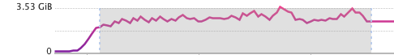

# Postgres IMDB test

+ `29 671 440` movies.
+ `8` Gb memory.
+ Postgres 16.0
+ Spring + MyBatis

## Setup

+ Download "PostgreSQL Dump of IMDB Data" from https://dataverse.harvard.edu/dataset.xhtml?persistentId=doi:10.7910/DVN/2QYZBT
+ Run docker compose

## Test

Test - read all movies into the memory:

```bash
http http://localhost:8080/movies/memory
```

Test - read all movies using a cursor:

```bash
http http://localhost:8080/movies/cursor
```

| Fetch size | Response Time | Memory usage |
|------------|---------------|--------------|
| -          | -             | OOM          |
| 10_000_000 | 74791         | 2-3.5 GB     |
| 1_000_000  | 74270         | 400-770 MB   |
| 100_000    | 78212         | 150-300 MB   |
| 10_000     | 88150         | 100-160 MB   |
| 1_000      | 110745        | 60-130 MB    |

### Memory usage

+ `10_000_000` 
+ `1_000_000` 
+ `100_000` 
+ `10_000` 
+ `1_000` 

### Fitting


## Conclusion

According to the fit graph, sweet spot is somewhere between `10^4` and `10^5`.

⚠️ This is 5-min guessed conclusion. The answer depends on traffic, usage, real data etc. ⚠️
